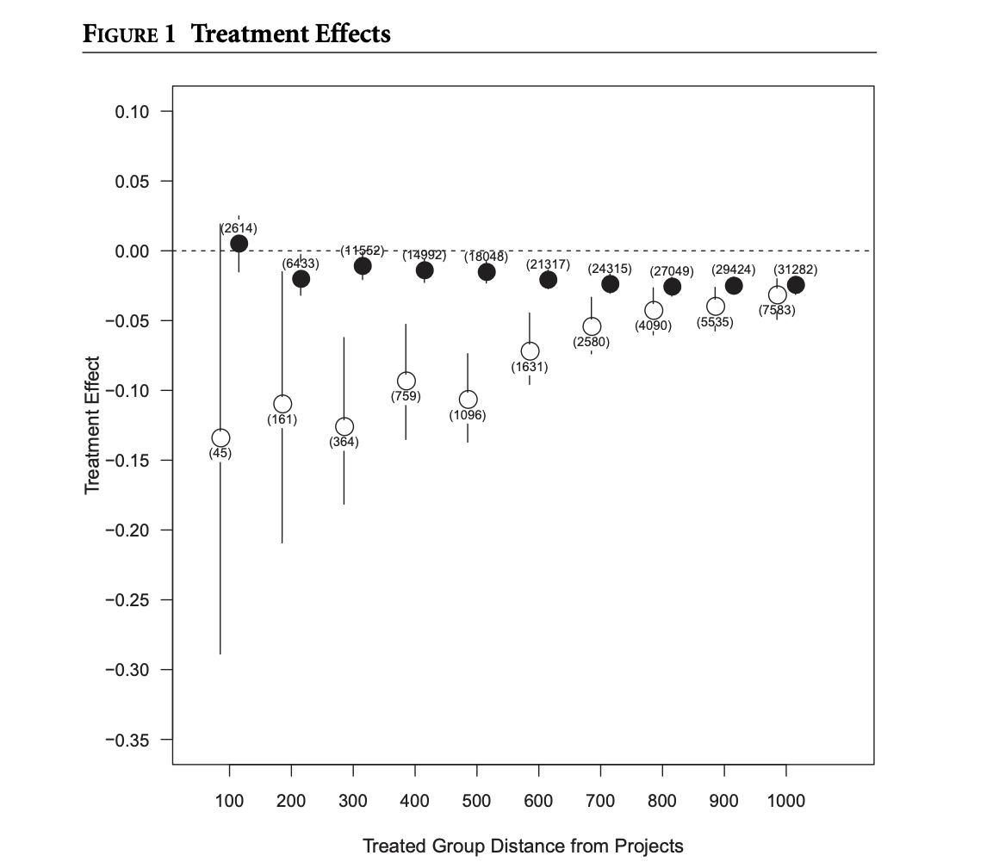
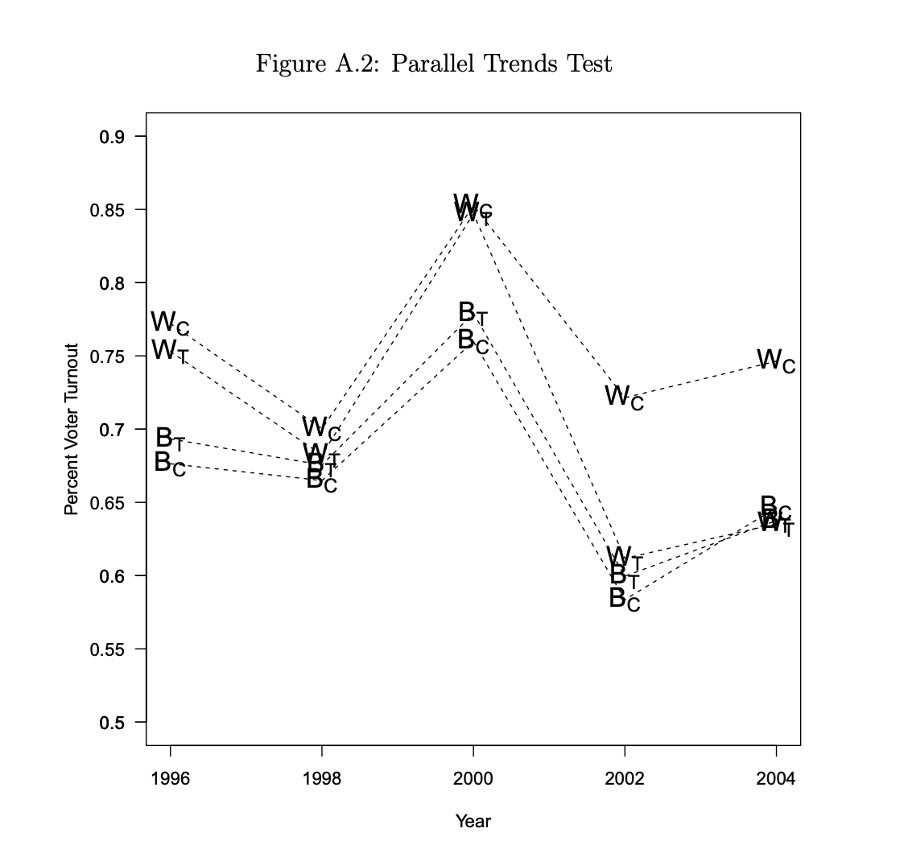

```{r setup, include=FALSE}
knitr::opts_chunk$set(echo = TRUE)

# loading relevant libraries

library(dplyr)
library(tidyverse)
library(ggplot2)
library(ggthemes)

library(bookdown)
library(tinytex)

library(gt)
library(gtsummary)
library(stargazer)

library(knitr)
library(styler)

library(rstanarm)
library(patchwork)

library(lubridate)


#library(boot)

options(tinytex.verbose = TRUE)


# setting up global values

# this package is about statistical estimates.
library(ei)
# package helpful for matching treated and control groups with similar covariate
# distributions.
library(MatchIt)
# package for producing simple weighted statistics
library(weights)
# simple bootstrapping -- didn't know this existed.
library(simpleboot)
# helpful statistics package, especially for modeling
library(Zelig)
# package that helps format latex objects side by side
library(apsrtable)

# Need to set wd so that my work is reproducible.

# so that I can crop
tinytex::tlmgr_install("pdfcrop")

# how to reference 

```

# Abstract

# Introduction

# Literature Review

 $A = \pi*r^{2}$ 

# Replication 





# Extension

# Appendix

```{r Setting Up Replication, echo=FALSE, message=FALSE, eval=FALSE}

# setting up global values

# this package is about statistical estimates.
library(ei)
# package helpful for matching treated and control groups with similar covariate
# distributions.
library(MatchIt)
# package for producing simple weighted statistics
library(weights)
# simple bootstrapping -- didn't know this existed.
library(simpleboot)
# helpful statistics package, especially for modeling
library(Zelig)
# package that helps format latex objects side by side
library(apsrtable)

### master graphic parameters for graphics
ylims <- c(-.35, .1)
ylims.2 <- c(-.45, .1)
xlims <- c(.5, 11)
# changing to see what happens 
dists <- seq(from = 1000, to = 100, by = -100) ### DELETE THIS LATER
xs <- seq(1:length(dists))
ys <- seq(from = -.35, to = .1, by = .05)
ys.lab <- c("-0.35", "-0.30", "-0.25", "-0.20", "-0.15", "-0.10", "-0.05", "0.00", "0.05", "0.10")
ys.2 <- seq(from = -.45, to = .1, by = .05)
ys.lab.2 <- c("-0.45", "-0.40", "-0.35", "-0.30", "-0.25", "-0.20", "-0.15", "-0.10", "-0.05", "0.00", "0.05", "0.10")

offsets <- .15
text.offsets <- .025
cex.axis <- .9
cex.N <- .7
top.text.adj <- c(1.3, 1.3) ## offsets on labels to reduce crowding
bottom.text.adj <- c(-.15, -.85)
point.size <- 2
line.offset <- .0175
```

```{r Figure 1 Replication, echo = FALSE, results="asis", eval=FALSE}

# how to display results.
# how to only display graph 1, not the appendix stuff
## load data
# ALSO WHY DO THE GRAPHS APPEAR IN SEPARATE PDFS, HOW CAN I GET THEM TO APPEAR WITHIN THIS MARKDOWN DOCUMENT?

wtreat <- read.csv("data/data_clean/white.treat.effect.mean.boot.csv")

wtreat.lower <- read.csv("data/data_clean/white.treat.effect.conf.boot.lower.csv")

wtreat.upper <- read.csv("data/data_clean/white.treat.effect.conf.boot.upper.csv")

Nwtreat <- read.csv("data/data_clean/white.treat.N.csv")

btreat <- read.csv("data/data_clean/black.treat.effect.mean.boot.csv")

btreat.lower <- read.csv("data/data_clean/black.treat.effect.conf.boot.lower.csv")

btreat.upper <- read.csv("data/data_clean/black.treat.effect.conf.boot.upper.csv")

Nbtreat <- read.csv("~/Desktop/Gov_1006_Projects/replication_2/dataverse_files/black.treat.N.csv")

## letters for marking graphs, one is not used
 #use.letters <- c("a", "b", "c", "d", "e", "f", "skip", "g", "h")

## cycle through each line of data, each of which are groups defined by diferent namepcts

#for (i in 1:nrow(wtreat)) 
  { ## turning into matrices helps below with segment function
    
  use.wtreat <- as.matrix(wtreat[7, ])
  use.wlower <- as.matrix(wtreat.lower[7, ])
  use.wupper <- as.matrix(wtreat.upper[7, ])
  use.Nwtreat <- as.matrix(Nwtreat[7, ])
  use.btreat <- as.matrix(btreat[7, ])
  use.blower <- as.matrix(btreat.lower[7, ])
  use.bupper <- as.matrix(btreat.upper[7, ])
  use.Nbtreat <- as.matrix(Nbtreat[7, ])

  # how to just get figure_1.pdf to display
  # also how to get the pdf to display in my document?

  ## name graphs
  # if (i == 7) {
  #   
  #   pdf("Figure_1.pdf")
  # }
   
  # else {
  #   pdf(paste("Figure_A1", use.letters[i], ".pdf", sep = ""))
  # }
  
  
  par(las = 1)
  
  par(mar = c(5.1, 4.1, .5, .5))
 
  x <- plot(xs, use.wtreat,
    ylim = ylims,
    xlim = xlims,
    type = "n",
    ylab = "Treatment Effect",
    xlab = "Treated Group Distance from Projects",
    xaxt = "n",
    yaxt = "n.csv"
  )
  
  ## ZERO LINE
  
  abline(h = 0, lty = 2)

  ### draw lines first because I want them to be covered by points
  #### create spaces in lines using the offset (this allows the N to be displayed with the text() function)
  
  ## black lines are offset to the left, white lines to the right
  segments(
    x0 = xs[1:2] + offsets, x1 = xs[1:2] + offsets, ## only do it for low N blacks because otherwise lines look funny
    y0 = use.btreat[, 1:2], y1 = use.blower[, 1:2]
  )
  
  segments(
    x0 = xs[1:2] + offsets, x1 = xs[1:2] + offsets,
    y0 = use.btreat[, 1:2] + line.offset, y1 = use.bupper[, 1:2]
  )
  
  ## now the others
  segments(
    x0 = xs[3:10] + offsets, x1 = xs[3:10] + offsets,
    y0 = use.blower[, 3:10], y1 = use.bupper[, 3:10]
  )

  segments(
    x0 = xs - offsets, x1 = xs - offsets, ## bottomlines
    y0 = use.wtreat - line.offset, y1 = use.wlower
  )

  segments(
    x0 = xs - offsets, x1 = xs - offsets, ## toplines
    y0 = use.wtreat, y1 = use.wupper
  )


  ## points and N descriptions
  
  ## WHITE DOT POINTS
  points(xs - offsets, use.wtreat,
    cex = point.size,
    pch = 21,
    bg = "white",
    col = "black"
  )
  
  ## WHITE DOT LABELS
  text(xs - offsets, use.wtreat,
    paste("(", use.Nwtreat, ")", sep = ""),
    cex = cex.N,
    adj = top.text.adj,
    pos = 1
  )
  
  ## BLACK Dot Points

  points(xs + offsets, use.btreat,
    pch = 16,
    cex = point.size
  )
  
  ## Black Dot Lables
  
  text(xs + offsets, use.btreat,
    paste("(", use.Nbtreat, ")", sep = ""),
    cex = cex.N,
    adj = bottom.text.adj,
    pos = 3
  )
  
  ## X AXIS Controls

  axis(
    side = 1,
    at = xs,
    label = seq(100, 1000, 100),
    cex.axis = cex.axis
  )
  
  ## Y AXIS Controls
  
  axis(
    side = 2,
    at = ys,
    label = ys.lab,
    cex.axis = cex.axis
  )

  dev.print()
}


x


```

```{r Figures 2-3 Replication, echo=FALSE, results = "asis", eval=FALSE}

## this cycles thorugh a bunch of dataframes, each of which is needed for a different graph
for (figure in c( "white.demo.main", "blackmain")) {

  # if (figure == "white.basic.main")
  # {
  # 
  #    ## this group is different than the rest because the second set is not actually a diff in diff, but calling it "diffs" for consistency
  #   treat <- read.csv("data/data_clean/white.match.basic.csv")
  #   #treat.2 <- read.csv("data/data_clean/white.match.basic.property.csv")
  #   #fig.nums <- c("A3", "A4") ## figure names
  #   pchs <- c(17, 17) ## point types
  # }
  
  if (figure == "white.demo.main") 
  {
    treat <- read.csv("data/data_clean/white.match.nondemolished.csv")
    diffs <- read.csv("data/data_clean/white.match.nondemolished.diffs.csv")
    fig.nums <- c("2")
    pchs <- c(17)
  }

  # if (figure == "white.demo.property") {
  #   treat <- read.csv("~/Desktop/Gov_1006_Projects/replication_2/dataverse_files/white.match.nondemolished.property.csv")
  #   diffs <- read.csv("~/Desktop/Gov_1006_Projects/replication_2/dataverse_files/white.match.nondemolished.diffs.property.csv")
  #   fig.nums <- c("A6", "A7")
  #   pchs <- c(17, 22)
  # }

  # if (figure == "white.demo.localrace") 
  # {
  #   treat <- read.csv("data/data_clean/white.match.nondemolished.localrace.csv")
  #   diffs <- read.csv("data/data_clean/white.match.nondemolished.diffs.localrace.csv")
  #   fig.nums <- c("A8", "A9")
  #   pchs <- c(17, 22)
  # }
  
  if (figure == "blackmain") 
  {
    treat <- read.csv("data/data_clean/white.match.black.property.csv")
    diffs <- read.csv("data/data_clean/white.match.black.diffs.property.csv")
    fig.nums <- c("3")
    pchs <- c(17)
  }
  
  # if (figure == "blackcensus") 
  # {
  #   treat <- read.csv("data/data_clean/white.match.black.csv")
  #   diffs <- read.csv("data/data_clean/white.match.black.diffs.csv")
  #   fig.nums <- c("A10", "A11")
  #   pchs <- c(17, 21)
  # }

  ## define axis for different graphs
 
   if (figure %in% c("white.basic.main", "white.demo.main", "blackmain")) 
  {
    use.ylims <- ylims
    use.ys.lab <- ys.lab
    use.ys <- ys
  }
  
  else 
  {
    use.ylims <- ylims.2
    use.ys.lab <- ys.lab.2
    use.ys <- ys.2
  }

  # go through pairs for each pair of dataframe
  for (i in 1)
  {
    if (i == 1)
    {
      use.treat <- treat$coefficient
      clower <- use.treat - (1.96 * treat$stdev)
      cupper <- use.treat + (1.96 * treat$stdev)
      use.N.treat <- treat$N.treatment + treat$N.control
    }

    if (i == 2 & figure != "white.basic.main")
    {
      use.treat <- diffs$mean.diff
      clower <- diffs$low.ci
      cupper <- diffs$high.ci
      use.N.treat <- diffs$N
    }

    # if (i == 2 & figure == "white.basic.main") 
    # { ## white.basic.main figures have slightly different structure
    #   use.treat <- treat.2$coefficient
    #   clower <- use.treat - (1.96 * treat.2$stdev)
    #   cupper <- use.treat + (1.96 * treat.2$stdev)
    #   use.N.treat <- treat.2$N.treatment + treat.2$N.control
    # }

    # if (figure %in% c("white.demo.main", "blackmain") & i == 1) 
    # {
    #   pdf(paste("Figure_", fig.nums[i], ".pdf", sep = ""))
    # 
    # }
    # else 
    # {
    #   pdf(paste("Figure_", fig.nums[i], ".pdf", sep = ""))
    # }
    
    par(las = 1)
    
    par(mar = c(5.1, 4.1, .5, .5))
    
    plot(xs, use.treat,
      ylim = use.ylims,
      xlim = xlims,
      type = "n",
      ylab = "Treatment Effect",
      xlab = "Treated Group Distance from Projects",
      xaxt = "n",
      yaxt = "n"
    )
    
    # ZERO LINE
    
    abline(h = 0, lty = 2)

    # UPPER TREND LINE
    segments(
      x0 = xs, x1 = xs,
      y0 = use.treat + line.offset, y1 = cupper
    )
    
    # LOWER TREND LINE
    segments(
      x0 = xs, x1 = xs,
      y0 = use.treat, y1 = clower
    )

    ## Treatment Effects
    points(xs, use.treat,
      pch = pchs[i],
      cex = point.size,
      bg = "white",
      col = "black"
    )
    
    text(xs, use.treat,
      paste("(", use.N.treat, ")", sep = ""),
      cex = cex.N,
      pos = 3
    )
    
    # X AXIS LABEL
    
    axis(
      side = 1,
      at = xs,
      label = seq(100, 1000, 100),
      cex.axis = cex.axis
    )
    
    # Y AXIS LABEL
    
    axis(
      side = 2,
      at = use.ys,
      label = use.ys.lab,
      cex.axis = cex.axis
    )

    #dev.print()
  }
}

# black triange 64 = 2
# black triangle 74 = 3

```

# Conclusion

```{r FigureA2, eval = FALSE, fig.height=3, fig.width=1, fig.align="CENTER", fig.caption = "NO CAP", echo=FALSE}

```


Bibliography

